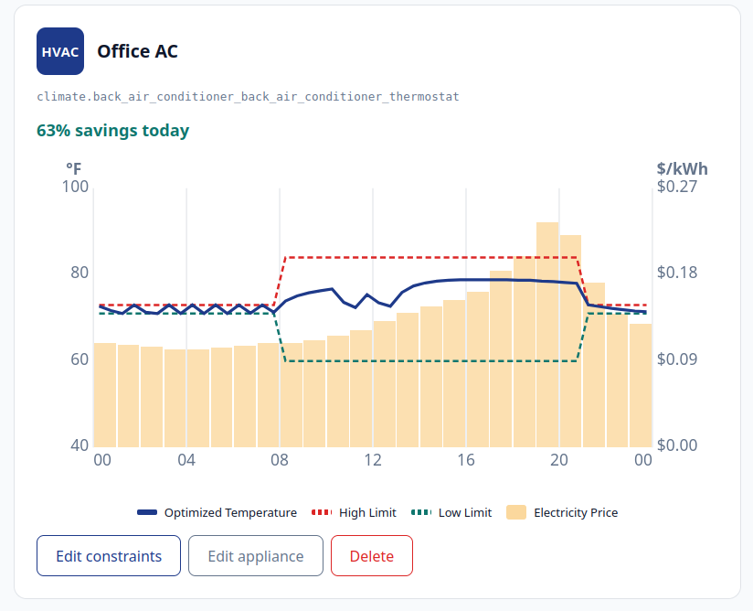

# Hungry Machines — Home Assistant Integration

Hungry Machines optimizes when your home runs its biggest energy users — HVAC, EV charger, home battery, water heater — to shift load into the cheapest hours of your time-of-use rate plan, while keeping the comfort and charge constraints you set.

This package adds the Hungry Machines control surface to Home Assistant: a sidebar panel for managing schedules and constraints, plus two Lovelace cards for at-a-glance status. Sign in with the same account you create at [hungrymachines.io](https://hungrymachines.io), and your dashboard shows the schedules generated each night.

Learn more at **[hungrymachines.io](https://hungrymachines.io)**.

See how it works and experience the benefits in the [online game](https://hungrymachines.io/feed-your-hungry-machines/).

Questions: [info@hungrymachines.io](mailto:info@hungrymachines.io).




---

## What you get

- **`hungry-machines-panel`** — full-page sidebar entry. Sign in, then **add the appliances you want optimized** (one or more HVACs, plus an EV charger, home battery, water heater, or solar array), map each one to its Home Assistant entities, edit the comfort and charge constraints the optimizer respects, choose your pricing, and review a per-appliance diagnostics view that flags sensor or connection problems.
- **`hm-thermostat-card`** — Lovelace card with current indoor/outdoor temperature, an optimization chart (your comfort limits + the optimizer's predicted temperature trajectory over a 24-hour price backdrop), and a savings-level slider. Pin it to one HVAC with `appliance_id` when you run more than one.
- **`hm-savings-card`** — Lovelace card with today's estimated savings, current home power draw, and the next scheduled appliance run. Scope it to a single HVAC with `appliance_id`, or leave it whole-home.

All three share one sign-in. Sign in once via the panel and the cards activate everywhere on your dashboard — your token persists in your browser's localStorage. Each card also shows a small health badge when its underlying sensors look stale, so you're never silently optimizing on bad data.

## How it works

1. You register your appliances and set your preferences in the panel inside Home Assistant. Each HVAC is mapped to its own climate entity (and optional indoor-temperature, humidity, and power sensors); EV chargers, batteries, and water heaters are mapped to their own entities; solar is forecast-only for now.
2. Throughout the day, your Home Assistant captures readings from each appliance (HVAC: indoor temperature, HVAC state and mode, fan, target setpoint, humidity, power) and pushes them to the Hungry Machines Optimization API. The optimizer uses this stream to fit a **per-HVAC thermal model** — without it, the backend falls back to default rates and the optimization is significantly less exact. On the first warm day after you add an HVAC, the backend runs a short one-time **calibration window** (a forced morning cooling pattern) so it can learn how that unit responds; the panel shows a banner while it's running, with a **Skip** option.
3. Each night, Hungry Machines resolves a 24-hour weather forecast and your rates, then runs an optimization per appliance that picks operating intervals to minimize cost while staying inside your comfort and charge constraints.
4. Your Home Assistant pulls the resulting schedule and, on every 30-minute boundary, applies it to each appliance. For HVAC that means setpoint, mode, and fan; for EV/battery/water heater it switches the device on or off. The panel and cards in this package show what's running, what's coming next, and how much you save.

The optimization itself (per-HVAC thermal models, HVAC scheduling, EV/battery load-shifting, water-heater control, solar coupling) lives in the backend. You can visit the [online game](https://hungrymachines.io/feed-your-hungry-machines/) to experience how it works. This package is the user-facing window into it.

## Requirements

- Home Assistant with [HACS](https://hacs.xyz/docs/setup/download) installed.
- A Hungry Machines account — sign up at [hungrymachines.io](https://hungrymachines.io).
- For each HVAC you want optimized, a `climate.*` entity in Home Assistant. A power sensor, a dedicated indoor-temperature sensor, and a humidity sensor are optional but improve the model (you map all of these per-appliance when you add it in the panel). A `weather.*` entity is optional too; pick it in the panel's **Settings** tab to feed the optimizer your local forecast (the backend falls back to generic data if you don't).

---

## Install

No `configuration.yaml` editing required. Five steps, all from the Home Assistant UI.

### Step 1 — Create your Hungry Machines account

Go to **[hungrymachines.io](https://hungrymachines.io)** and sign up. Confirm your email when the verification message arrives. The email and password you set there are what you'll use to sign in inside Home Assistant.

### Step 2 — Add the integration to HACS

1. In Home Assistant, open **HACS → ⋮ (top right) → Custom repositories**.
2. Add `https://github.com/hungrymachines/energy-dashboard` with **Type: Integration**.
3. Search for **Hungry Machines** in HACS and click **Download**.
4. Restart Home Assistant when HACS prompts you.

### Step 3 — Add the integration

1. Open **Settings → Devices & Services → Add Integration**.
2. Search for **Hungry Machines** and click it.
3. Enter your **hungrymachines.io email and password** (the same credentials you use on the website and inside the panel) and click **Submit**. That's the only thing the config flow asks for — you pick your appliances and their entities later, in the panel (Step 4).

A **Hungry Machines** entry now appears in your sidebar, and the two Lovelace cards become available in the dashboard card picker. The integration also begins its background tasks: it captures readings from each registered appliance (buffered and pushed periodically, so the optimizer math can learn how your home responds), once a day it pushes your weather forecast, and each morning it fetches today's optimized schedules and applies them to the appliances.

### Step 4 — Sign in and add your appliances

Click the **Hungry Machines** entry in the sidebar and enter the same hungrymachines.io email and password to load your dashboard. The first time in, the dashboard is empty — use **Add appliance** to register each device you want optimized:

- Pick a type (HVAC, EV charger, home battery, water heater, or solar).
- For HVAC, choose the `climate.*` entity it controls and, optionally, dedicated indoor-temperature / humidity / power sensors. Add a card per HVAC if you have more than one — each gets its own thermal model and schedule.
- For EV charger / battery / water heater, choose the switch and any state-of-charge or tank-temperature sensor.

Each appliance card then shows today's optimized schedule, an **Edit constraints** button, and a per-appliance pause toggle. You can edit or delete an appliance at any time.

### Step 5 — Add the cards (optional)

The panel is the primary surface; the cards are extras for your existing dashboards. In any Lovelace dashboard, click **Add card → Search "Hungry Machines"**, then fill in the entity IDs that match your home:

```yaml
type: custom:hm-thermostat-card
# Optional: pick a specific HVAC when you have more than one registered.
# With exactly one HVAC the card auto-resolves and this can be omitted.
# appliance_id: 11111111-2222-3333-4444-555555555555
entities:
  indoor_temp: sensor.living_room_temp
  outdoor_temp: sensor.outside_temp
  hvac_action: sensor.hvac_action
```

```yaml
type: custom:hm-savings-card
# Optional: scope the savings figure (and the integration-health badge)
# to one HVAC. Omitted → whole-home average + next scheduled run.
# appliance_id: 11111111-2222-3333-4444-555555555555
entities:
  power: sensor.home_power
```

Sign-in is shared with the panel — once you've signed in, the cards light up immediately.

---

## Configuration

Everything you'd expect to tune lives inside the panel's **Settings** tab:

- **Weather entity** — optionally pick the `weather.*` entity whose forecast is pushed to the optimizer each day. (Per-appliance HVAC sensor entities are chosen when you add the appliance, not here.)
- **Pricing source** — one section with two modes:
  - **Static (time-of-use zone)** — choose a preset rate plan from the catalog (the list covers common US utilities). If none fits, switch on **hourly rate overrides** and enter your own per-hour ¢/kWh. If you would like to add a new area or location, please contact us at [info@hungrymachines.io](mailto:info@hungrymachines.io). 
  - **Dynamic (changes daily)** — follow real-time and dynamic prices for a supported grid region instead of a fixed TOU schedule. Pick your **Region** (currently ComEd and Ameren Illinois) and a **delivery charge estimate** (a flat ¢/kWh added to the wholesale price to approximate delivery, capacity, and taxes). ComEd customers can additionally pick their **Delivery plan** — the ComEd Delivery Time-of-Day rate — which prefills four editable per-period distribution prices (Morning, Mid-Day Peak, Evening, Overnight) from the published rate table for that plan; check them against the Distribution Facility Charge lines on your own bill and edit any that differ, so the per-half-hour distribution charge follows your own numbers instead of an estimate. With a plan chosen, the flat delivery-charge field then only needs to cover the small non-delivery residual (taxes, supply riders), around 2¢/kWh. The Region, Delivery plan, period-price, and delivery-charge fields only appear when Source = Dynamic (Delivery plan and period prices only appear once your utility offers a plan). If you have another area or location to add, please contact us at [info@hungrymachines.io](mailto:info@hungrymachines.io). 
- **Send feedback** — a short form to send a comment, bug report, or feature request to the team without leaving Home Assistant.
- **Account** — sign out, or email info@hungrymachines.io if you want your account deleted.

Comfort and charge constraints are edited per-appliance from the **Dashboard** — each appliance card has an **Edit constraints** button that opens a per-type editor, plus a **pause toggle** that excludes that one appliance from optimization without deleting it (there's also a master optimization switch that pauses everything):

- **HVAC** — base temperature, savings level (1 = tight ±2°F, 2 = moderate ±6°F, 3 = aggressive ±12°F), optimization mode (`cool`, `heat`, `auto`, `off`), and `time_away` / `time_home` (HH:MM, the times you typically leave and return). An optional **hourly comfort bands** override lets advanced users specify a per-hour low/high in °F across all 24 hours instead of the symmetric base±band — useful if your comfort needs change throughout the day in ways the base+savings-level abstraction can't capture.
- **EV charger** — target charge %, minimum charge %, current charge %, deadline time (HH:MM by which the target must be reached).
- **Home battery** — target charge %, minimum charge %, deadline time.
- **Water heater** — minimum and maximum tank temperature (°F).

## Manual install (without HACS)

If you don't use HACS:

1. Download `hungry_machines.zip` from the [latest GitHub release](https://github.com/hungrymachines/energy-dashboard/releases).
2. Unzip into your Home Assistant config at `custom_components/hungry_machines/` (the zip contains the integration's files; create the directory if it doesn't exist).
3. Restart Home Assistant.
4. Continue from **Step 3** above (Settings → Devices & Services → Add Integration).

## Uninstall

1. **Settings → Devices & Services**, click **Hungry Machines**, then the ⋮ menu, then **Delete**. The sidebar entry and Lovelace cards disappear.
2. To remove the package entirely, also remove it from HACS.

## Support

- **Account, billing, product questions:** [info@hungrymachines.io](mailto:info@hungrymachines.io)
- **Learn more:** [hungrymachines.io](https://hungrymachines.io)
- **Bug reports for this package:** [GitHub issues](https://github.com/hungrymachines/energy-dashboard/issues)

## For developers

This package is open-source — patches and forks welcome. Build from source (Node 20+):

```bash
npm install
npm run build      # → custom_components/hungry_machines/frontend/hungry-machines.js
npm test           # vitest suite
```

The Python integration is a thin shim that registers the bundled JS file as a Lovelace resource and registers the sidebar panel. All product logic lives in the TypeScript bundle. Architecture reference: [`structure.md`](structure.md).


## Changelog

- **v3.3.0** — feat: **home robot appliance (dock-charging first cut).** Register a robot vacuum or mower (`vacuum.*` / `lawn_mower.*` entity, optional battery sensor), set a daily Tasks window plus target and minimum charge, and the nightly plan schedules dock time in the cheapest half-hours before the window. The integration only ever sends the robot to its dock — it never undocks it and never starts a cleaning or mowing task (the robot's own schedule owns tasks) — and a robot off its dock with a low battery is sent home to charge regardless of the plan. Robot cards plot the charge trajectory like EV and battery cards. Requires a backend with the `robot` appliance type (API migration 056).
- **v3.0.5** — chore: repository housekeeping — trimmed internal development/process files from the published repo and tidied the contributor docs. No functional change; the integration is identical to v3.0.4.
- **v3.0.4** — docs: refresh the README to match the v3.x feature set (multi-HVAC appliances, the credential-only config flow, dynamic wholesale pricing, the diagnostics view, the calibration banner, the in-app feedback form, and per-appliance pause). Removed the stale `climate_entity` field and dead options-flow strings from `strings.json` / `translations/en.json` so the "Add integration" dialog matches the credentials-only flow. No functional/runtime change.
- **v3.0.3** — docs: the dynamic-pricing "Flat adder" field is now labeled **Delivery charge estimate** to make clear what the ¢/kWh add-on represents.
- **v3.0.2** — fix: the dynamic-pricing **Region** and delivery-charge fields are hidden unless **Source = Dynamic**, so static-zone users don't see irrelevant controls.
- **v3.0.1** — feat: consolidate all pricing controls into one **Pricing source** section (static zone vs. dynamic wholesale, with the custom-rate editor hidden while dynamic is active). feat: dashboard price bars refresh on revisit (daily rollover + after edits). feat: completed-calibration banners can be dismissed and auto-expire after a TTL, with the choice persisted per run in localStorage.
- **v3.0.0** — feat: **multi-HVAC + multi-ISO dynamic pricing + in-app feedback.** Register more than one HVAC, each mapped to its own climate entity and optional aux sensors at "Add appliance" time, each with its own thermal model, schedule, constraint editor, and pause toggle; the entity-uniqueness guard rejects mapping two HVACs to the same climate entity. Both Lovelace cards accept an optional `appliance_id` to scope to one HVAC (thermostat-card auto-resolves the sole HVAC; savings-card defaults to whole-home). New **Pricing source = Dynamic** mode follows real-time wholesale prices for a chosen grid region (ComEd + Ameren Illinois in v1) plus a per-user delivery-charge estimate; legacy single-node PJM fields were dropped from the rates client. New **Send feedback** form in Settings. The pricing-zone catalog is now API-driven (`/api/v1/rates → available_pricing_zones`) instead of a hardcoded list.
- **v2.9.x** — feat: per-appliance **pause toggle** plus a master optimization switch — paused appliances are skipped by the morning apply loop and are woken back to manual control. feat: comfort-band failsafe — if indoor temperature drifts outside your band during a scheduled OFF slot, the integration overrides the OFF and runs the unit to bring you back in range.
- **v2.8.0** — feat: ground-truth signal layer + **diagnostics view.** Captures the commanded value alongside the observed state, reads an optional power sensor and indoor humidity, and snapshots aux-sensor health; the dashboard collapses all of this into a per-appliance sensor-health `<details>` panel with an at-a-glance badge. Extended the daily weather push with more forecast fields.
- **v2.7.0** — feat: **calibration banner + Skip.** While the backend runs the one-time HVAC calibration window (the forced morning cooling pattern that bootstraps a new unit's model), the panel shows an in-progress banner; a **Skip** button lets you opt out of that day's calibration.
- **v2.6.x** — feat: optional indoor-temperature fallback sensor (used when the climate entity doesn't expose `current_temperature`); appliance **edit + delete** from the dashboard; fan-mode sentinel fix so `"auto"`/`"off"` slots leave the unit's fan alone. fix: compute the current schedule slot from HA's configured **local** time (not the container's UTC clock) and fire a startup weather push to plug the gap after an HA restart.
- **v2.5.x** — feat: apply **HVAC mode and fan**, not just the setpoint, on each 30-minute boundary, with matching panel toggles for `optimize_hvac_mode` / `optimize_hvac_fan`. feat: the `hm-thermostat-card` Lovelace card now renders the same optimization chart as the dashboard panel card. Chart axis polish (hour-only x labels, per-appliance y range). fix: defensive ECO-in-cache fallback and mode-toggle copy.
- **v2.4.x** — feat: **set-then-verify** — after sending a command, re-read the entity a minute later and re-send if it didn't stick (some thermostats silently drop the first call); trust the commanded mode over stale entity state at mode transitions. Verify delay tuned from 2.5 min to 1 min.
- **v2.3.1** — fix: ship the v2.0.1 / v2.1.0 / v2.2.0 changes that were left uncommitted in the v2.3.0 release. `src/main.ts` now actually registers `<hm-optimization-chart>` (without this the chart tag rendered as an inert unknown element on HA — no graph). `__init__.py` reads the manifest version once at module-import time (kills the blocking-call warning HA logs every restart) and splits the readings poll into a 5-min capture + hourly flush (~12× fewer API calls). `api.py` + `readings.py` ship the matching buffered-readings client. No backend change.
- **v2.3.0** — feat: extend the user-facing optimization chart to water heater, EV charger, and home battery cards. Water heater plots tank temperature with high/low temperature limits; EV charger and home battery plot state-of-charge (%) with a flat dashed minimum-charge line and a marker dot at the user's target charge + deadline (e.g. "70% by 08:00"). Backend change: the nightly job now persists, alongside `temp_trajectory` (HVAC), `value_trajectory` (EV/battery), and `temp_trajectory` (water heater), the user's `min_value` / `target_value` / `deadline_interval` (load schedules) and `high_temps` / `low_temps` arrays (water heater) inside the `appliance_schedules.schedule` JSONB. Charts render best after the next nightly run on the v2.3 API; older rows still render whatever line series they carry.
- **v2.2.0** — feat: user-facing optimization chart for HVAC cards. Shows the user's hourly High Limit + Low Limit as dashed lines, the optimizer's predicted indoor-temperature trajectory as a solid line, all overlaid on a 24-hour bar chart of electricity prices. Replaces the technical band/setpoint chart for HVAC; non-HVAC appliance cards continue to use the existing schedule chart. Backend change: the nightly optimizer now persists `schedule.temp_trajectory` (48 floats) in `appliance_schedules`, exposed via `/api/v1/schedules` and `/api/v1/schedule`. Until the next nightly run after deploy, HVAC charts show limits + price bars without the target line; this is graceful — nothing breaks, the trajectory fills in from day 1 of the new backend.
- **v2.1.0** — feat: hourly batched readings push. Capture continues every 5 min into an in-memory buffer keyed by destination; flush fires once per hour (~minute=2) with one POST per non-empty bucket. ~12× fewer API calls per hour with no loss of data fidelity (the optimizer fits over 14+ days of observations, so freshness within an hour is invisible). Failed POSTs retain the bucket for the next flush. Trade-off: an HA restart between flushes can drop ≤55 min of buffered readings — fine for thermal-model fitting; if it ever matters, the buffer can be moved to `homeassistant.helpers.storage.Store`.
- **v2.0.1** — fix: read the integration version from manifest.json once at module import time instead of inside the async `_ensure_frontend_registered` path. The previous v2.0.0 wiring did sync `open()` from the event loop, which HA 2024.x flags as a blocking-call warning per [asyncio_blocking_operations](https://developers.home-assistant.io/docs/asyncio_blocking_operations/). No behaviour change beyond log noise reduction.
- **v2.0.0** — feat: closed control loop across every registered appliance. Per-appliance entity_id (and optional sensor entities) is now picked at "Add appliance" time inside the panel and persisted to Supabase, replacing the integration's old single-climate-entity config flow and the panel's localStorage entity_map. The readings poller iterates appliances and routes per-type (HVAC home reading → `/api/v1/readings`; EV/battery/water_heater per-appliance → `/api/v1/appliances/{id}/readings` with optional SoC / tank-temp aux sensor reads). The scheduler applies HVAC via `climate.set_temperature` and the rest via `switch.turn_on`/`turn_off`. New daily 03:30 UTC weather pusher reads the user's selected `weather.*` entity (now persisted via PATCH /auth/me) and POSTs the forecast so the API's nightly optimizer prefers it over Open-Meteo. **Breaking config change** — appliances added on v1.x lack `entity_id` and will need to be deleted + re-added once on v2.0; the config flow drops the climate-entity question entirely.
- **v1.1.2** — fix: readings poller is now scheduled with an `async def` callback so HA awaits it on the event loop. The previous sync-def + `hass.async_create_task` pattern fired from a worker thread, which HA 2024.x raises as `RuntimeError: ... calls hass.async_create_task from a thread other than the event loop`. Symptom on v1.1.1: every 5-min tick logged the error and dropped the reading. Fixed; readings now flow. fix: the bundled JS is now served at `/hungry_machines/hungry-machines.js?v=<version>` so browsers auto-bust their cache on every release. Previously the URL had no query string, so even after HACS replaced the bundle on disk, browsers kept serving the previously-cached copy until the user manually hard-refreshed the panel — now updates take effect immediately on the next page load after restart.
- **v1.1.1** — fix: HVAC editor save now updates the panel's cached preferences immediately, so reopening the editor reflects the saved value without a full reload. feat: readings poller logs at INFO when it skips a tick (missing entity / no `current_temperature` attribute / etc.), so misconfigurations are debuggable from `home-assistant.log` without enabling debug-level logging.
- **v1.1.0** — Initial v1 release matching the post-Phase-1 backend: per-appliance constraints persisted, per-appliance schedule endpoint returns the documented shape, OpenAPI codegen + contract test infrastructure, full panel HVAC editor (`time_away` / `time_home` / hourly comfort bands).
- **v1.0.0** — feat: poll the configured climate entity every 5 minutes and push readings to the API; the optimizer now has data to learn from.
- **v0.3.4** — Fix: schedule applier was caching empty arrays, no setpoints were ever applied (regression from v0.3.0). The applier now correctly reads `appliance.schedule.high_temps` / `appliance.schedule.low_temps` from `/api/v1/schedules` instead of looking one level too high on the appliance entry itself.

## License

MIT — see [`LICENSE`](LICENSE).
